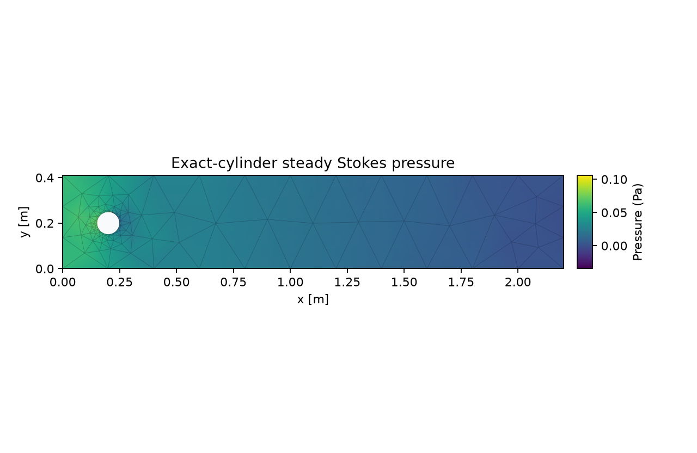

# Eqiora

Eqiora is an open-source computational engineering platform that represents
models as one typed network of mathematical relations, then carries that
meaning through numerical realization to auditable evidence.

> **Alpha — `0.1.0a3`.** Eqiora currently provides carefully bounded,
> executable slices of its intended system. It is research software, not a
> safety control or a complete multiphysics product. Every supported claim and
> explicit nonclaim is indexed in the
> [capability matrix](docs/capability-matrix.md) and the reproducible
> [`verify/`](verify/) catalogue.

## Start with Python

The alpha distribution supports ordinary-GIL CPython 3.11–3.14 on
manylinux x86-64:

```console
python -m pip install "eqiora[gmsh]==0.1.0a3"
```

Build an exact rectangle-with-circular-hole geometry, resolve its chordal mesh,
run the accepted steady-Stokes application, and inspect typed evidence from the
immutable `Result`:



```python
from importlib.resources import files

import eqiora

graph = eqiora.geometry.GeometryGraph()
rectangle = graph.rectangle(x_bounds=(0.0, 2.2), y_bounds=(0.0, 0.41))
circle = graph.circle(center=(0.2, 0.2), radius=0.05)
fluid = graph.subtract(rectangle, circle)
geometry = graph.build(fluid, named_topology={
    "fluid": fluid.region,
    "inlet": rectangle.boundaries[0],
    "outlet": rectangle.boundaries[1],
    "walls": rectangle.boundaries[2:4],
    "cylinder": circle.boundaries[0],
})
mesh_request = eqiora.meshing.MeshRequest(
    eqiora.meshing.GmshMesher(
        maximum_boundary_error=1e-4,
        minimum_mean_ratio=1e-5,
        maximum_boundary_facets=50,
    )
)
mesh_plan = eqiora.meshing.resolve(geometry, mesh_request)
mesh = eqiora.meshing.generate(geometry, plan=mesh_plan)

model = eqiora.compile(
    path=files(eqiora).joinpath("examples", "steady-flow-past-cylinder.eqi"),
    geometry=geometry,
    parameters={
        "dynamic_viscosity": 1.0e-3,
        "zero_pressure": 0.0,
        "inlet_speed": 0.3,
        "channel_height": geometry.bounds[1][1] - geometry.bounds[1][0],
    },
)
linear = eqiora.solve.Linear(
    relative_tolerance=1e-6,
    absolute_tolerance=1e-13,
    maximum_iterations=10_000,
)
plan = eqiora.resolve(
    model, mesh=mesh, spatial=eqiora.fem.MiniP1(), solve=linear, scaling=None,
)
result = eqiora.run(plan)
evidence = eqiora.fluid.steady_stokes_evidence(result)

print(result.plan_key)
print(evidence.solve)
print("pressure", evidence.pressure_minimum, evidence.pressure_maximum, "Pa")
print("cylinder force on fluid", evidence.cylinder_force_on_fluid, "N/m")
print("net flux", evidence.net_flux, "m^2/s")
```

This is deliberately one bounded case rather than a claim of general CFD. It
shows the distinction Eqiora is built around: exact geometry and model meaning
remain immutable, meshing and solver choices live in explicit resolved plans,
and the returned evidence stays tied to the same Model, Mesh, Run, and Result
lineage. [Walk through the pressure result](https://eqiora.org/gallery/exact-cylinder-steady-stokes/)
or run the complete
[`examples/python/exact_cylinder_stokes.py`](examples/python/exact_cylinder_stokes.py)
script with optional Matplotlib output.

For a bounded local file check, the installed `eqiora` binary accepts
`eqiora check <MODEL_PATH>`. It reads one UTF-8 regular file, prints only a
structural comparison fingerprint when the current Model is accepted, and
prints bounded normalized diagnostics when compilation rejects it. The
command does not execute the Model, write an artifact, accept stdin or
multiple files, expose JSON, or make Python or Studio a CLI subprocess client.

Local agents can separately compile/check one in-memory Eqiora source through
the `eqiora-mcp` subprocess. It exposes exactly one bounded MCP `2026-07-28`
tool over newline-delimited stdio and returns either structured compiler
diagnostics or the current Model descriptor and comparison fingerprint. It
does not execute a model, transport scientific results, persist an artifact,
or provide remote, Python, or Studio integration. Python remains the first
execution API and can serve the initial gallery directly; a future Studio
client can consume the same Rust-owned model semantics through its own
independently verified projection.

## One model, two layers

Eqiora treats block diagrams, state charts, PDEs, and acausal physical
networks as views of the same small semantic kernel. A canonical model is a
network of typed relations, activations, and signal or conserving
connections. Numerical choices—mesh, discretization, solver, schedule, CPU,
GPU, or distributed execution—belong to a separate **Realization**.

That separation is enforced by one traceable path:

```text
meaning → lowered contract → realization → adapter → evidence
```

Source, Python, Studio, and future visual editors therefore create
transactions against one Rust-owned model semantics; none is a second
authority. Optimized adapters may widen execution, but only registered
falsifiers and evidence widen a public capability claim.

## What this alpha proves

The release includes bounded, reproducible vertical slices for the semantic
kernel and language, reference hybrid execution, scalar Operator IR,
one-to-three-dimensional scalar elliptic FEM/FVM paths, selected host/CUDA/MPI
adapters, implicit differentiation, versioned artifacts, Python model
construction and execution, and a thin Studio projection. The exact domain,
platform, method, and maturity of each slice are recorded in the
[capability matrix](docs/capability-matrix.md); the
[architecture guide](docs/architecture.md) explains their boundaries.

Important nonclaims include:

- no stable-1.0 compatibility promise;
- pre-1.0 authoring APIs may be replaced without aliases or a deprecation period
  as the repository converges on one coherent final surface; released artifacts
  and explicitly versioned persisted contracts remain immutable;
- no macOS, Windows, free-threaded Python, GPU wheel, or bundled MPI package;
- no complete CFD, FSI, CAD, controls, or physical-component catalogue;
- no general high-order, adaptive, mixed/tensor-field, or arbitrary-DAE path;
- no claim of being a complete Simulink, Simscape, or commercial CAE
  replacement;
- no certification for safety-critical or production engineering decisions.

## Project

- [Website and documentation](https://eqiora.org)
- [Python package](https://pypi.org/project/eqiora/)
- [Capabilities](docs/capability-matrix.md)
- [Published benchmarks](docs/benchmarks.md)
- [Architecture](docs/architecture.md)
- [Roadmap](docs/roadmap.md)
- [Contributing](CONTRIBUTING.md)
- [Security](SECURITY.md)
- [Governance](GOVERNANCE.md)
- [Release policy](docs/development/python-release-policy.md)

Eqiora is developed in public under the
[Apache License 2.0](LICENSE). Contributions require a
[Developer Certificate of Origin](CONTRIBUTING.md#developer-certificate-of-origin)
sign-off.
